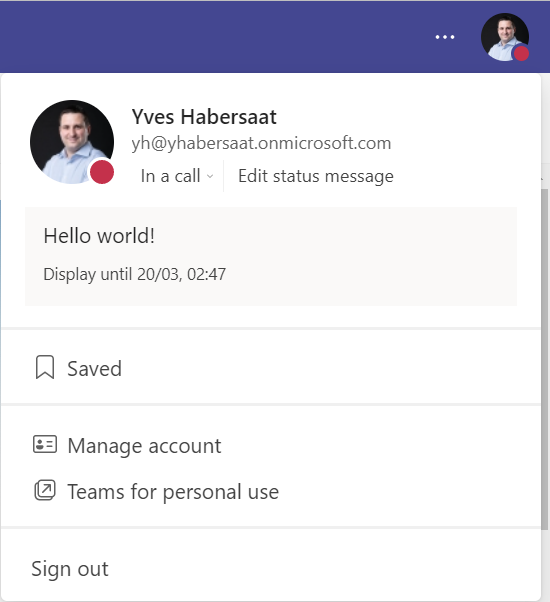

# BasicCard-StatusMessage

## Summary

This ACE demonstrates how to use the Presence Graph API endpoints (beta) to get/set a status message and availability/activity for a user.

## Compatibility

## Applies to

* [SharePoint Framework](https://docs.microsoft.com/sharepoint/dev/spfx/sharepoint-framework-overview)
* [Microsoft 365 tenant](https://docs.microsoft.com/sharepoint/dev/spfx/set-up-your-development-environment)

## Prerequisites

> You need to approve the following Microsoft Graph permissions at the tenant level:

* Presence.ReadWrite
* Application.Read.All

NOTE: This sample uses some beta Graph endpoints (Presence). The beta endpoints can change at any time and should not be used in production.

## Solution

Solution|Author(s)
--------|---------
BasicCard-StatusMessage | [Yves Habersaat](https://github.com/yhabersaat) ([@yhabersaat](https://twitter.com/yhabersaat)), Sword Group

## Version history

Version|Date|Comments
-------|----|--------
1.1|January 22, 2023|Added new Presence API capabilities (get/set availability and activity)
1.0|December 21, 2022|Initial release

## Disclaimer

**THIS CODE IS PROVIDED *AS IS* WITHOUT WARRANTY OF ANY KIND, EITHER EXPRESS OR IMPLIED, INCLUDING ANY IMPLIED WARRANTIES OF FITNESS FOR A PARTICULAR PURPOSE, MERCHANTABILITY, OR NON-INFRINGEMENT.**

---

## Minimal Path to Awesome

* Clone this repository
* in the command line run:
  * `npm install`
  * `gulp serve`

Before running the solution you will need to access the SharePoint Admin Center > Advanced > API Access and approve the Graph API requests.

## References

* [Getting started with SharePoint Framework](https://docs.microsoft.com/en-us/sharepoint/dev/spfx/set-up-your-developer-tenant)
* [Build your first SharePoint Adaptive Card Extension](https://docs.microsoft.com/en-us/sharepoint/dev/spfx/viva/get-started/build-first-sharepoint-adaptive-card-extension)
* [Designing Viva Connections custom cards for your dashboard](https://docs.microsoft.com/en-us/sharepoint/dev/spfx/viva/design/design-intro)
* [Building for Microsoft teams](https://docs.microsoft.com/en-us/sharepoint/dev/spfx/build-for-teams-overview)
* [Use Microsoft Graph in your solution](https://docs.microsoft.com/en-us/sharepoint/dev/spfx/web-parts/get-started/using-microsoft-graph-apis)
* [Publish SharePoint Framework applications to the Marketplace](https://docs.microsoft.com/en-us/sharepoint/dev/spfx/publish-to-marketplace-overview)
* [Microsoft 365 Patterns and Practices](https://aka.ms/m365pnp) - Guidance, tooling, samples and open-source controls for your Microsoft 365 development

