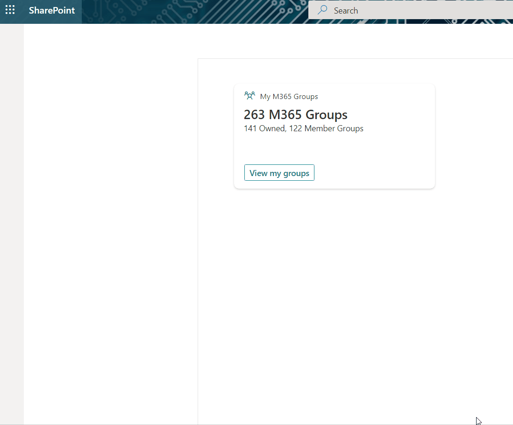
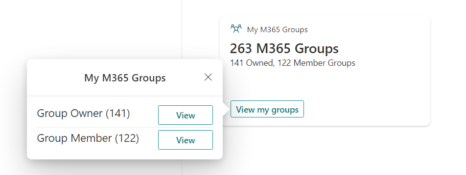
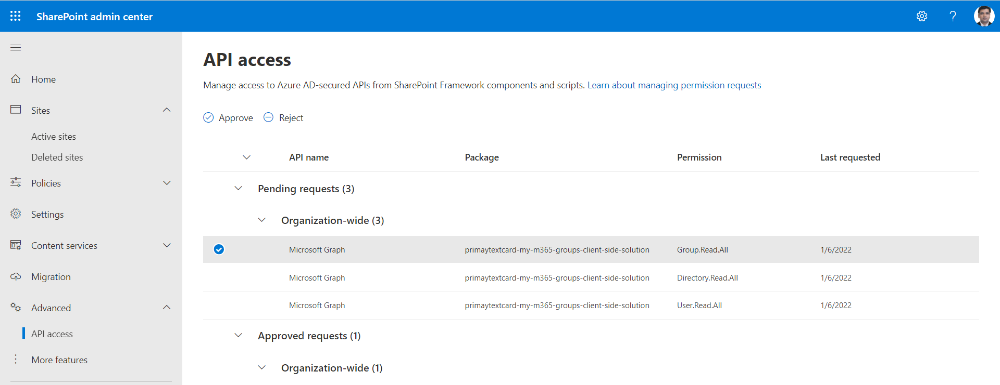

# My M365 Groups

## Summary

This sample shows how to build an ACE with a card view and multiple quick views to display the M365 (Unified) groups in a tenant, of which user is owner or member.

### Highlights
- Displays current logged in user'e M365 (Unified) groups in card view.
- Action buttons on card view to browse to groups, of which user is owner or member.
- Quick view showing M365 Group details.
- Buttons on Quick view to take user to associated SharePoint site and MS Teams (if connected).

### Demo



### Screenshots of other cards

View Card - M365 Groups Summary



View Card - M365 Group Details


## Used SharePoint Framework Version


## Applies to

- [SharePoint Framework](https://aka.ms/spfx)
- [Microsoft 365 tenant](https://docs.microsoft.com/en-us/sharepoint/dev/spfx/set-up-your-developer-tenant)

> Get your own free development tenant by subscribing to [Microsoft 365 developer program](http://aka.ms/o365devprogram)

## Prerequisites

After deploying the solution to tenant app catalog, SharePoint administrator needs to approve the Graph API permissions from SharePoint admin center > Advanced > API access blade.



You need following set of permissions in order to get Office 365 groups. Find out more about consuming the [Microsoft Graph API in the SharePoint Framework](https://docs.microsoft.com/en-us/sharepoint/dev/spfx/use-aad-tutorial)

```
"webApiPermissionRequests": [  
  {
    "resource": "Microsoft Graph",
    "scope": "Group.Read.All"
  },
  {
    "resource": "Microsoft Graph",
    "scope": "Directory.Read.All"
  },
  {
    "resource": "Microsoft Graph",
    "scope": "User.Read.All"
  }
]
```

## Solution

Solution|Author(s)
--------|---------
My M365 Groups | [Nanddeep Nachan](https://github.com/nanddeepn), [@NanddeepNachan](https://twitter.com/NanddeepNachan) (https://nanddeepnachanblogs.com)
&nbsp;|[Smita Nachan](https://github.com/SmitaNachan), [@SmitaNachan](https://twitter.com/SmitaNachan) 

## Version history

Version|Date|Comments
-------|----|--------
1.0|January 07, 2022|Initial release

## Disclaimer

**THIS CODE IS PROVIDED *AS IS* WITHOUT WARRANTY OF ANY KIND, EITHER EXPRESS OR IMPLIED, INCLUDING ANY IMPLIED WARRANTIES OF FITNESS FOR A PARTICULAR PURPOSE, MERCHANTABILITY, OR NON-INFRINGEMENT.**

---

## Minimal Path to Awesome

- Clone this repository.
- Ensure that you are at the solution folder.
- in the command-line run:
  - **npm install**
- Create the solution pacjage (.sppkg file) using:
  - **gulp bundle --ship**
  - **gulp package-solution --ship**
- Deploy the package (primaytextcard-my-m365-groups.sppkg) to the tenant app catalogue.
- The solution needs following Microsoft Graph API permissions. Approve the API access requests in the SharePoint admin center.

  | Permissions         |
  |---------------------|
  | Group.Read.All      |
  | Directory.Read.All  |
  | User.Read.All  |

- in the command-line run:
  - **gulp serve -l --nobrowser**
- Open the workbench page (https://tenantname.sharepoint.com/sites/sitename/_layouts/15/workbench.aspx)
- Add the ACE named **My M365 Groups** to the page.

## Features

This extension illustrates the following concepts:

- Using Microsoft Graph to get the M365 Groups
- Submit action handling in ACE and Quick View
- Customizing Quick View Adaptive Card JSON template to create customized UI

## References

- [Getting started with SharePoint Framework](https://docs.microsoft.com/en-us/sharepoint/dev/spfx/set-up-your-developer-tenant)
- [Building for Microsoft teams](https://docs.microsoft.com/en-us/sharepoint/dev/spfx/build-for-teams-overview)
- [Use Microsoft Graph in your solution](https://docs.microsoft.com/en-us/sharepoint/dev/spfx/web-parts/get-started/using-microsoft-graph-apis)
- [Publish SharePoint Framework applications to the Marketplace](https://docs.microsoft.com/en-us/sharepoint/dev/spfx/publish-to-marketplace-overview)
- [Microsoft 365 Patterns and Practices](https://aka.ms/m365pnp) - Guidance, tooling, samples and open-source controls for your Microsoft 365 development